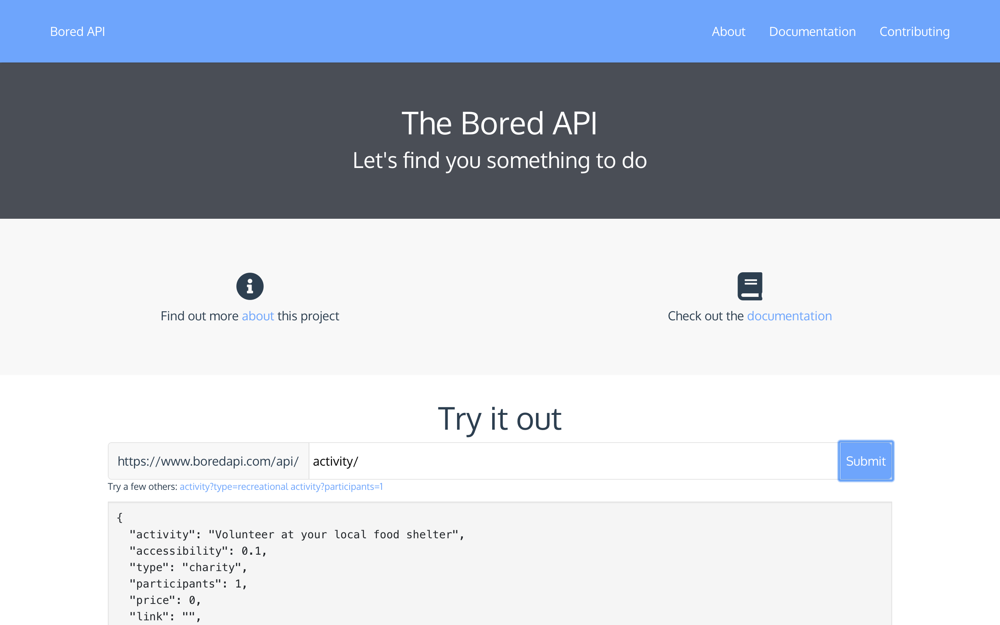

# Bored API
A free and simple API to help you find something better to do



## About
This project is an MEVN (MongoDB, Express.js, Vue.js, and Node.js) web app that has a goal of creating a simple way to find things to do. You <u>do not need an API key</u> to use this API, just query the endpoint to get data. All activities served by the API can be found [here](./activities.json).

---
## Endpoints
The full documentation can be found [here](https://www.boredapi.com/documentation), but listed below are a few of the endpoints.

#### Random event
Gets a random event
```
/api/activity/
```
Response:
```
{
  "activity": "Learn Express.js",
  "accessibility": 0.25,
  "type": "education",
  "participants": 1,
  "price": 0.1,
  "link": "https://expressjs.com/",
  "key": "3943506"
}
```

#### Get by type
Query for events by a certain type
```
/api/activity?type=:type
```
Response:
```
{
  "activity": "Learn how to play a new sport",
  "accessibility": 0.2,
  "type": "sports",
  "participants": 1,
  "price": 0.1,
  "key": "5808228"
}
```

---
## Using
To set up your own Bored API, clone the app, start your MongoDB instance, and run:
```bash
npm install
npm start
# Started on port 8080
```

---
## Contributing
All help is welcome! A pull request or a new issue would be very appreciated. If you want to add more activities, I've created a UI on the [website](https://www.boredapi.com/contributing) to make suggesting easy.

---
## Usage
The Bored API has been used in many other applications and projects:

* [I'm Bored Alexa skill](https://www.amazon.com/gp/product/B07GDL9MP4?ie=UTF8&ref-suffix=ss_rw)
* [Python wrapper](https://pypi.org/project/bored/)
* [Kotlin wrapper](https://gitlab.com/CMDR_Tvis/bored-api)
* [React app](https://github.com/CDAracena/Im-Bored)
* [Vue app](https://github.com/emilsgulbis/BoredApp)
* [iOS app](https://apps.apple.com/us/app/bored-find-what-to-do/id1475656469)
